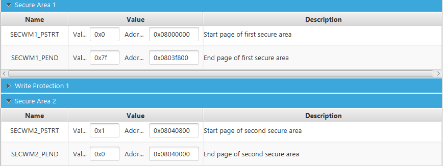
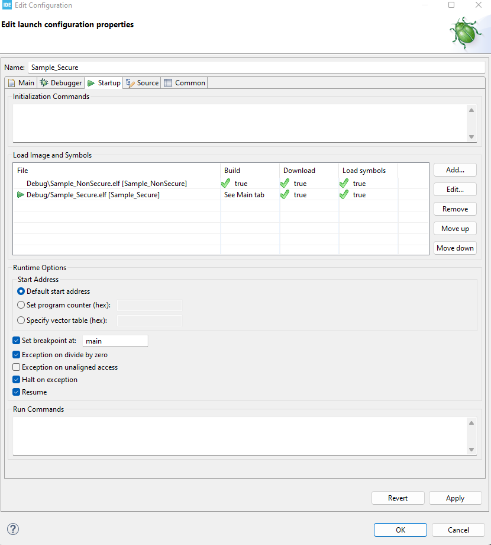
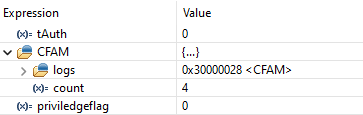

# ISC-FLAT

This is the open source repository for the paper ISC-FLAT: On the Conflict Between Control Flow Attestation and Real-Time Operations, presented at the 2023 IEEE 29th Real-Time and Embedded Technology and Applications Symposium (RTAS’2023)

## Abstract

The wide adoption of IoT gadgets and CyberPhysical Systems (CPS) makes embedded devices increasingly
important. While some of these devices perform mission-critical
tasks, they are usually implemented using Micro-Controller
Units (MCUs) that lack security mechanisms on par with those
available to general-purpose computers, making them more
susceptible to remote exploits that could corrupt their software
integrity. Motivated by this problem, prior work has proposed
techniques to remotely assess the trustworthiness of embedded
MCU software. Among them, Control Flow Attestation (CFA)
enables remote detection of runtime abuses that illegally modify
the program’s control flow during execution (e.g., control flow
hijacking and code reuse attacks).

Despite these advances, current CFA methods share a fundamental limitation: they preclude interrupts during the execution
of the software operation being attested. Simply put, existing
CFA techniques are insecure unless interrupts are disabled
on the MCU. On the other hand, we argue that the lack of
interruptability can obscure CFA usefulness, as most embedded
applications depend on interrupts to process asynchronous events
in real-time.

To address this limitation, we propose Interrupt-Safe Control
Flow Attestation (ISC-FLAT): a CFA technique that is compatible
with existing MCUs (i.e., does not require hardware changes)
and enables interrupt handling without compromising the authenticity of CFA reports. Similar to other CFA techniques that
do not require customized hardware modifications, ISC-FLAT
leverages a Trusted Execution Environment (TEE) (in particular,
our prototype is built on ARM TrustZone-M) to securely generate
unforgeable CFA reports without precluding applications from
processing interrupts. We implement a fully functional ISC-FLAT
prototype on the ARM Cortex-M33 MCU and demonstrate that
it incurs minimal runtime overhead when compared to existing
TEE-based CFA methods that do not support interrupts.

---
## Preparing the environment

Below is the description of the steps needed to reproduce the code in this repository:

1. Download STM32CubeProgrammer 1.9.0 v2.10.0
2. Connect NUCLEO-L552ZE-Q using the usb port.
3. Open STM32CubeProgrammer:
    *   Connect with the NUCLEO-L552ZE-Q
    
    Activate TrustZone:
    *   Go to user configuration and set "TZEN" and "DBANK" variables
    *   Go to the security areas and set as below

4. Download STM32CubeIDE 1.9.0

---
# Interrupt attack

This section demonstrates interrupt-based attacks on Control Flow Attestation (CFA) architectures based on code instrumentation and TEEs, such as C-FLAT (ACM CCS'16) and follow ons, e.g., OAT (S&P'19).
We note that C-FLAT original paper acknoleges that their design requires interrupts to be disabled.
Therefore, the attacks in this repo should not be interpreted as a mistep on C-FLAT's design.
They serve instead as (1) an illustration of the consequences of removing this requirement; and (2) as motivation to pursue alternative designs that can support interrupts securely, making CFA friendly to real-time tasks.
The attacks discussed here were prototyped on the Arm-v8 Cortex-M33 MCU on a NUCLEO-L552ZE-Q board.

## Rationale

CFA architectures generate an authenticated log of all control-flow transfers during the execution of a given software.
This log can be used by a remote verifier to check the control-flow integrity of tasks runing on the device being attested (called a Prover).
The log must be unforgeable by any attacker that fully compromises the prover's software, except for its minimal CFA TCB (typically isoalted within a TEE).

CFA mechanisms based on TEEs instrument the executable to log control flow transfers onto TEE-protected memory.
Since non-branching instructions cannot produce control-flow transfers, only branching instructions (e.g, jumps, returns, calls, etc) are instrumented.
The CFA example in this repo is based on C-FLAT and thus uses blocks of instructions. A block is a sequence of non-branching instructions.
Each block is instrumented to log two entries, one before the first instruction in the block and one before the the last instruction in the block (i.e., the branching instruction).
The Figure below is an illustration of and instrumented block (a.k.a. a node in the program's control flow graph).

The node/block instrumentation approach described above is only secure when interrupts are disabled.
When interrupts are enabled, they can be leveraged to trigger control-flow transfers within blocks.
This repository exemplifies a class of attacks that leverage malicious interrupts to stealthly corrut the control-flow of the attested program.

In this example, we consider a toy software operation composed of three blocks of instructions, i.e., 3 nodes in its control flow graph.
This softwre operation executes repeatedly in the main application loop on the embedded device.
Node 1 and Node 3 (below) execute at every iteration of the main loop.
For simplicity we use a bogus "for" noting that, in reallity, nodes should not contain branching instructions (i.e., "for-s").
Each of the Nodes generates two log entries in the format XY, where X is the node label and Y indicated is this entry corresponds to the first or last instruction within the node.
Number 1 is used for the node's entry point and number 2 for the node's exit point.

https://github.com/RIT-CHAOS-SEC/ISC-FLAT_open_source/blob/68a98d87f613c5b7ba7bd72f8a1129a03972a408/attackSample/NonSecure/Core/Src/attack.c#L95-L98

https://github.com/RIT-CHAOS-SEC/ISC-FLAT_open_source/blob/68a98d87f613c5b7ba7bd72f8a1129a03972a408/attackSample/NonSecure/Core/Src/attack.c#L107-L110

Node 2 (below) represents a priviledged node that can only be accessed by changing the variable tAuth to 1. In this example, tAuth is never changed, so the attested operation is not supposed to run instructions within this node.

https://github.com/RIT-CHAOS-SEC/ISC-FLAT_open_source/blob/68a98d87f613c5b7ba7bd72f8a1129a03972a408/attackSample/NonSecure/Core/Src/attack.c#L100-L105

The attack starts by triggering a malicious Interrupt Service Routine (ISR) 1 - shown below - during the MCU's main loop.
This malicious ISR can be unrelated to the task being attested, e.g., pertain to a completely different (malicious) application running on the same device.
Alternatively it could have been remotely injected, e.g., via buffer overflow vulneralities outside the attested operation.
Still, it can stealthly compromise attestation logs pertaining to the benign attested operation. 

https://github.com/RIT-CHAOS-SEC/ISC-FLAT_open_source/blob/68a98d87f613c5b7ba7bd72f8a1129a03972a408/attackSample/NonSecure/Core/Src/attack.c#L58-L88

After interruping the operation being attested, the malicious ISR changes its own return address causing a jump inside Node 2 at line 103.

It also configures a second malicious ISR (shown below) to be triggered after 39x10-8 seconds.
This is the exact time needed by the processor to execute line 103 in Node 2 and nothing more.
Once triggered (after 39x10-8 seconds), malicious ISR 2 changes its own return address to the original returning address of malicious ISR 1.

https://github.com/RIT-CHAOS-SEC/ISC-FLAT_open_source/blob/68a98d87f613c5b7ba7bd72f8a1129a03972a408/attackSample/NonSecure/Core/Src/attack.c#L29-L56

In the figure below, the left part illustrates the expected control flow graph for the interrupt handling by a benign ISR.
The right part illustrates the attack discussed so far.

## Take-aways

We make the following important observations:

- This attack enables execution of any sub-sequence ("chunk") of instructions with the operation nodes/blocks. 
- This interrupt redirection can be repeated any number of times to create arbitrary execution behavior by leveraging out-of-order execution of various chuncks of instructions that exist within the benign binary. 
- Both executions (benign and attacked) generate the exact same CFA logs. This is because the instructions that log the control-flow transfers within the operation blocks are never reached during the attack. Malicious ISR 1 jumps past the logging of the block entry point. ISR 2 interrupts the block execution before the logging of the block exit point. Therefore, the attacked execution is indistiguishable from the bening execution based on the CFA results received by the verifier.

## Reproducing the attack
    
1. Create and configure a new project using the file Sample/Sample.ioc
    
    * File -> New -> STM32 Project Using existing STM32CubeMX COnfiguration file (.ioc)
    * A warning popup will appear when starting the project, click on Yes to generate the code. 
    * Add/Replace the following files of the project with the equivalent files of this repo :
        
        1. {Project_Name}_NonSecure/Core/Src/main.c
        2. {Project_Name}_NonSecure/Core/Src/attack.c
        3. {Project_Name}_NonSecure/Core/Src/stm32l5xx_it.c
        4. {Project_Name}_NonSecure/Core/Inc/attack.h
        5. {Project_Name}_NonSecure/Core/Inc/stm32l5xx_it.h
        6. Secure_nsclib/secure_nsc.h
        7. {Project_Name}_Secure/Core/Src/secure_nsc.c
        8. {Project_Name}_Secure/Core/Src/attestation.c
        9. {Project_Name}_Secure/Core/Inc/attestation.h

    * Open the file NonSecure/Core/Src/attack.c and add breakpoints on the lines that have the following comment : "// Add breakpoint here"
    * In the project explorer tab, right click on {Project_Name}_Secure -> Debug As -> STM32 Cortex-M C/C++ Application
    * Go to the tab Startup, then click Add to add the project {Project_Name}_NonSecure. The debug configuration should be similar with the image below :

2. Start the debugger
    * In the Expressions tab, add the following variables
        1. tAuth : This variable guarantee the access to priviledge code. Is never changed in the code.
        2. CFAM : Is the CFA memory where the logs are.
        3. priviledgedflag : Is the flag that the attack will illegaly set without letting the CFA mechanism detect it 
    * Resume the Debugger in the main loop until the priviledgeflag change to one
    * Analyse the CFAM memory and tAuth 

### Results :

Run the Debugger until reach the breakpoint in line 112 for the first time.

https://github.com/anonymous12434/Interruption_Attack_on_CFA/blob/9414fb18b5b5931109e08242a6b527bb1ae9d1b9/Sample/NonSecure/Core/Src/attack.c#L106-L112

At this point the interruption was not called yet. It is possible to see that the CFA method generates 4 logs : {11, 12, 31, 32} and the privledgeflag value is still 0.

Running one more iteration until the same breakpoint it is possible to see that the interruption was called and the attack happened. The value of tAuth is still 0, so in a normal situation the Node 2 was not supposed to be executed, but we can see that the priviledgeflag is now set to 1.

By analysing the log generated by the CFA mechanism on the last iteration, we don't see the logs that were supposed to be generated by the node 2, meaning that the attack succeeded in tricking the mechanism.

---

# Using ISC-FLAT

## Instrumentation and Verification

The code for the instrumentation and verification will be available in as a library in a different repository soon.

Link will be available here.

For now, the code can be tested by manual instrumentation.

This repo is still incomplete, we will be working to finish it until the end of August 2023

